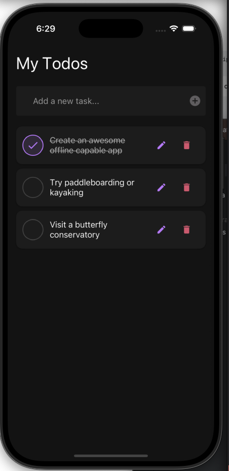

# RNTodoList - Offline-First Todo App

A React Native todo list application built with offline-first architecture, providing seamless task management regardless of network connectivity.



## Features

### Offline-First Architecture

- **Local Storage**: Tasks are saved locally using AsyncStorage
- **Initial Data**: Tasks initially fetched from DummyJSON API
- **Local Operations**: All add/edit/delete operations handled locally
- **Network Status**: Real-time connection monitoring
- **Data Flow**:
  1. Save changes to local storage
  2. Update UI immediately
  3. Maintain offline functionality
  4. Show network status clearly

### Task Management

- **Create Tasks**: Add new tasks that appear at the top of the list
- **Edit Tasks**: Modify task titles with save/cancel options
- **Delete Tasks**: Remove tasks immediately
- **Complete Tasks**: Toggle task completion with visual feedback
- **Task Ordering**: Latest tasks appear first

### Network Status Detection

- **Connection Types**: Detects online/offline state
- **Status Updates**: Adaptive polling (30s online, 5s offline)
- **Visual Indicators**:
  - Clear offline status message
  - Consistent dark theme styling
  - Border indicators for status

### UI/UX Features

- **Dark Theme**: Modern dark color scheme
- **Responsive Design**: Proper safe area handling
- **Visual Feedback**:
  - Task completion indicators
  - Edit mode with save/cancel
  - Network status updates
- **Smooth Interactions**:
  - Immediate local updates
  - Clean checkbox animations
  - Proper touch targets

## Technical Implementation

### Core Libraries

- [React Native](https://reactnative.dev/): Cross-platform mobile framework
- [React Native Paper](https://callstack.github.io/react-native-paper/): Material Design components
- [AsyncStorage](https://react-native-async-storage.github.io/async-storage/): Local data persistence
- [Redux](https://redux.js.org/): State management
- [TypeScript](https://www.typescriptlang.org/): Type safety and developer experience
- [Expo](https://expo.dev/): Development and build tools

### Components

- **Tasks**: Main screen with task management
- **TaskList**: Renders tasks with loading states
- **TaskListItem**: Individual task with edit/delete
- **AddTaskForm**: New task creation
- **NetworkStatusBar**: Connection status display

## Future Improvements

### Testing & Code Quality
- Add [Jest](https://jestjs.io/) unit tests for hooks and services
- Implement [React Native Testing Library](https://callstack.github.io/react-native-testing-library/) for component tests
- Add [Detox](https://wix.github.io/Detox/) E2E tests
- Set up [Expo EAS](https://docs.expo.dev/eas/) workflow for CI/CD
- Add test coverage reporting with [Jest Coverage](https://jestjs.io/docs/configuration#collectcoverage-boolean)
- Configure [Husky](https://typicode.github.io/husky/) pre-commit hooks:
  - Run unit tests
  - [ESLint](https://eslint.org/) checks
  - [Prettier](https://prettier.io/) formatting
  - TypeScript type checking

### Features
- Task categories/tags
- Due dates and reminders
- Task priority levels
- Sorting and filtering options
- Task search functionality
- Batch task operations

### UI/UX
- Task animations (swipe, completion)
- Drag and drop reordering
- Pull to refresh
- Custom themes support
- Accessibility improvements
- Haptic feedback

### Performance
- Task list virtualization
- Network request caching
- Bundle size optimization

### Architecture
- Enhanced error handling and monitoring:
  - [Sentry](https://docs.sentry.io/platforms/react-native/): Real-time error tracking with offline support
  - Custom error boundaries with offline fallbacks
  - Structured error logging with AsyncStorage queue
  - Network error recovery with retry logic
  - Offline-first error tracking strategy
- Performance monitoring:
  - [DataDog RUM](https://docs.datadoghq.com/real_user_monitoring/reactnative/): User experience analytics
  - Offline-capable network request tracking
  - Performance metrics with local buffering
  - Crash reporting with offline storage
  - Custom event tracking for task operations
- Better TypeScript types
- Code splitting and lazy loading
- Bundle size optimization
- Over-the-Air Updates:
  - [Expo Updates](https://docs.expo.dev/versions/latest/sdk/updates/): Automatic app updates
  - Phased rollout strategy
  - Offline fallback for failed updates
  - Update download on WiFi only
  - Background update checks
  - Update notifications

### Documentation
- API documentation
- Component storybook
- Contributing guidelines
- Code style guide
- Architecture diagrams

## Running the App

1. Install dependencies:

   ```bash
   npm install
   ```

2. Start the development server:

   ```bash
   npx expo start
   ```

3. Run on iOS/Android:
   - Use Expo Go app
   - Or run in simulator/emulator

## Development Notes

1. **Testing Offline Mode**:

   - Enable Airplane Mode
   - Add/edit/delete tasks
   - Verify local persistence
   - Check network status updates

2. **UI Testing**:

   - Verify safe areas on iOS/Android
   - Check dark theme consistency
   - Test task interactions
   - Monitor network status changes

3. **Data Management**:
   - Changes persist in AsyncStorage
   - Initial data from DummyJSON
   - Local operations only
   - Clear network status indication
