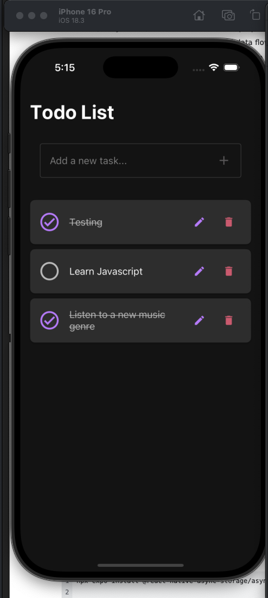
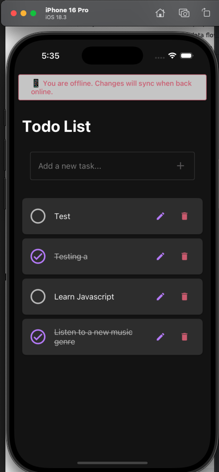

# RNTodoList

A React Native todo app with local-first task management and offline support. Built with Expo, TypeScript, Redux Toolkit, and Realm.

<div style="display: flex; justify-content: space-between; margin-bottom: 20px;">
  
  
</div>

## Core Features

- **Redux State Management**

  - Centralized state with Redux Toolkit
  - Efficient updates using Immer
  - Loading states per task ID
  - Set middleware for loadingTaskIds
  - Optimistic UI updates

- **Realm Database Integration**

  - Persistent data storage with Realm
  - TodoSchema with proper TypeScript types
  - Primary key conflict resolution
  - Efficient CRUD operations
  - Proper database lifecycle management

- **Data Export Functionality**

  - Export todos from Realm database as JSON
  - Timestamped exports in realm-data directory
  - Simple export via npm script
  - Proper error handling and logging

- **Local-First Architecture**

  - Initial data fetch from DummyJSON API
  - Local task operations
  - Responsive network status monitoring
  - Optimistic UI updates

- **Task Management**

  - Add, edit, and delete tasks locally
  - Offline data persistence
  - Modern task UI with React Native Paper
  - Timestamps for creation and updates
  - Optimistic updates for better UX

- **Network Handling**
  - Real-time connection monitoring with expo-network v7.0.5
  - Rapid polling (3s offline, 5s online)
  - Fast connection recovery detection
  - Connection type detection (WiFi, Cellular, etc.)
  - Internet reachability verification
  - Visual offline indicators
  - Proper cleanup with mounted flag

## Tech Stack

- React Native + Expo 49
- TypeScript
- Redux Toolkit
- Realm Database
- expo-network v7.0.5
- React Native Paper
- Jest + Testing Library
- ESLint + Prettier
- Husky

## Quick Start

1. Install dependencies:

```bash
npm install
```

2. Start the Expo server:

```bash
npm start
```

3. Run on device:

- Install Expo Go on your iOS/Android device
- Scan the QR code from terminal
- Or press 'i' for iOS simulator / 'a' for Android

## Development

### Test Suite

```bash
npm test           # Run Jest tests
npm run lint       # Run ESLint
npm run format     # Run Prettier
```

### Data Export

To export the todos from the Realm database:

1. Run the app in the simulator first to ensure the database exists
2. Execute the export command:

```bash
npm run export-todos
```

3. Exported JSON files will be created in the `realm-data` directory with timestamps

### Git Hooks

```bash
pre-commit:        # Run before each commit
  - TypeScript check
  - ESLint
  - Prettier
  - Jest tests

pre-push:          # Run before each push
  - Full test suite
  - Build check
```

### Project Structure

```
src/
├── components/    # Reusable UI components
│   └── NetworkStatusBar.tsx   # Network status indicator
├── hooks/
│   ├── network/  # Network status monitoring
│   └── todos/    # Task management hooks
├── services/     # TodoService with local storage
├── storage/      # Realm database integration
│   └── todoStorage.ts   # TodoStorage class for database operations
├── store/
│   └── slices/   # Redux slices (todos, network)
└── types/        # TypeScript definitions
scripts/
└── direct-export.js   # Script for exporting Realm database
```

### Architecture Evolution

#### State Management

- Migrated from local React state to Redux
- Implemented Redux Toolkit with Immer
- Centralized task state in store
- Added loading states per task ID
- Maintained optimistic updates

#### Data Persistence

- Migrated from AsyncStorage to Realm database
- Implemented TodoSchema with proper types
- Added TodoStorage class for database operations
- Included database path logging for debugging
- Added export functionality for data access

#### Network Monitoring

- Integrated expo-network v7.0.5 for status checks
- Optimized polling intervals for responsiveness
  - 3s checks when offline (quick recovery)
  - 5s checks when online (reduced battery impact)
- Added proper cleanup with mounted flag
- Enhanced error handling
- Clear offline status indication

### Key Features

#### Task Management

- Local task operations with Realm
- Persistent storage with proper schema
- Modern UI components
- Creation/update timestamps
- Optimistic updates

#### Network Status

- Optimized polling intervals
  - 3s offline for fast recovery
  - 5s online for efficiency
- Connection type detection
- Internet reachability checks
- Visual offline indicators
- Auto-reconnect handling
- Proper cleanup on unmount

#### Type Safety

- Comprehensive TypeScript coverage
- Redux state types
- Network state interfaces
- Task type definitions
- Realm schema types
- Strict null checks

## Testing

### Network Testing

- Development mode testing UI
- Simulated network states
- Mock responses match expo-network structure
- Real-time status display
- Error simulation support

## Planned Features

- [ ] Enhanced conflict resolution
- [ ] E2E tests with Detox
- [ ] Support for expo updates (OTA)

## Contributing

1. Fork the repo
2. Create a feature branch
3. Make your changes
4. Run tests and lint checks
5. Submit a PR

## License

MIT
